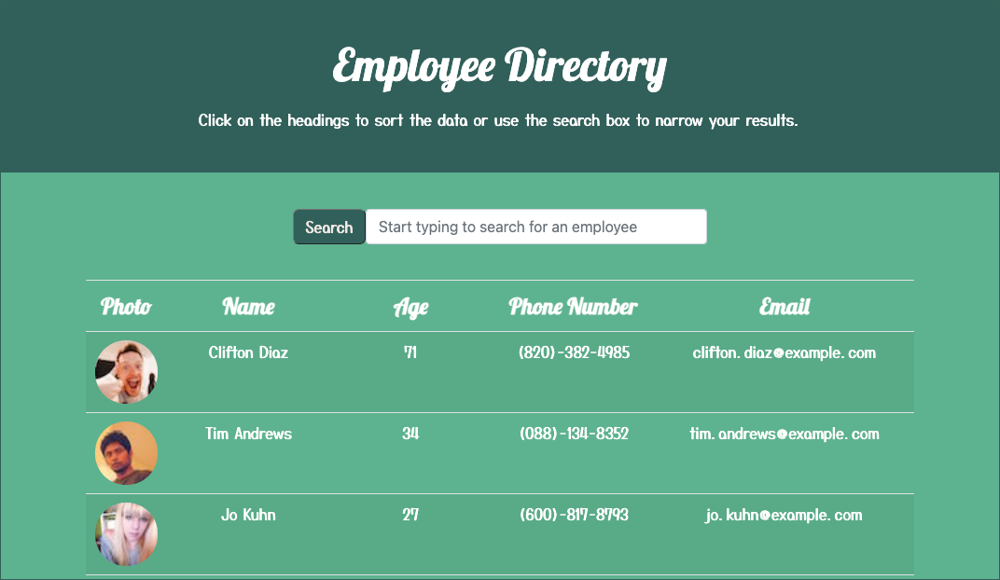

# Employee Directory

## Table of Contents

[Description](#description)  
[User Story](#user-story)  
[Technologies Used](#technologies-used)  
[Instructions for Use](#instructions-for-use)  
[Links](#links)  
[Screenshots](#screenshots)  
[License](#license)

## Description

An employee directory created with React.

## User Story

As a user, I want to be able to view my entire employee directory at once so that I have quick access to their information.

# Technologies Used

- HTML
- CSS
- Bootstrap
- JavaScript
- React
- Create React App
- Node.js
- randomuser.me API

## Instructions for Use

#### To Run Locally:

In the project directory, you can run:

`npm start`

Open [http://localhost:3000](http://localhost:3000) to view it in the browser.

#### To Use Deployed Application:

Go to: https://quiet-thicket-25023.herokuapp.com/

## Links

GitHub Repository: https://github.com/MeganCarnaghi/Employee-Directory.git

Deployed Application: https://quiet-thicket-25023.herokuapp.com/

## Screenshots

## License

